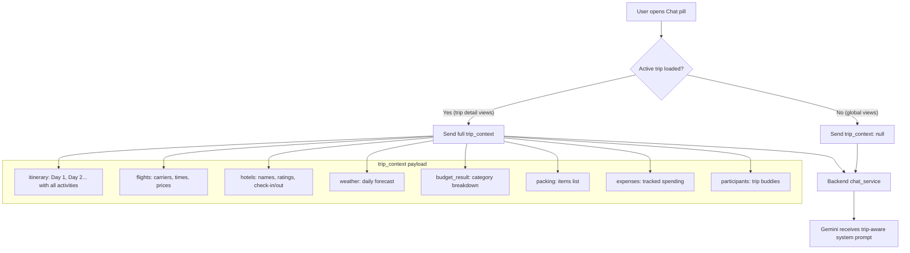

# WANDR Vacay Chatbot — Implementation Plan v2

> Follows [WANDR-vacay-chatbot.md](file:///Users/aryankumar/Vacay/WANDR-vacay-chatbot.md) exactly. The floating AICopilot bubble is removed. A new WANDR Chat is added to the navbar.

---

## What Exists Today

| Feature | Where | What It Does |
|---|---|---|
| **AICopilot** (floating bubble) | [AICopilot.tsx](file:///Users/aryankumar/Vacay/frontend/src/components/AICopilot.tsx) rendered in [layout.tsx](file:///Users/aryankumar/Vacay/frontend/src/app/layout.tsx) line 38 | Floating bottom-right sparkle button → opens a 360×500 chat popup. Sends messages to Gemini, gets generic replies. No tools, no context, no memory. |
| **Plan Intake + Orchestrator** | [/plan page](file:///Users/aryankumar/Vacay/frontend/src/app/plan/page.tsx) + [orchestrator.py](file:///Users/aryankumar/Vacay/backend/app/agents/orchestrator.py) | Conversational trip creation → runs 6 agents → generates full trip. |
| **Navbar** | [Navigation.tsx](file:///Users/aryankumar/Vacay/frontend/src/components/Navigation.tsx) | Two modes: Global header (logo + pills + notifications + auth) and Trip-detail header (destination title + sub-nav tabs). |

### What Happens to Each

| Feature | Action | Reason |
|---|---|---|
| **AICopilot bubble** | ❌ **Deleted** | Replaced by the new WANDR Chat panel in the navbar. |
| **Plan + Orchestrator** | ✅ **Untouched** | Different purpose (trip creation vs. travel assistance). |
| **All other features** | ✅ **Untouched** | Trips, itinerary, flights, hotels, budget, files, vacation calendar — zero changes. |

> [!IMPORTANT]
> We only touch the files listed in this plan. Everything else (providers, agents, trip APIs, pages, contexts) stays exactly as it is.

---

## The New WANDR Chat — Where It Lives

### Navbar Integration

A **"Chat" pill** is added to the center pill navigation, sitting right beside "Plan" as a sibling nav item. Clicking it toggles open a full-height chat panel from the right edge of the screen.

**Global header** ([Navigation.tsx](file:///Users/aryankumar/Vacay/frontend/src/components/Navigation.tsx) line 31 — `globalNavLinks` array):
```
[ WANDR Logo ]   [ My Trips | Time Off | Plan | Chat ← NEW ]   [ 🔔 ] [ Avatar ]
```

**Trip-detail header** ([Navigation.tsx](file:///Users/aryankumar/Vacay/frontend/src/components/Navigation.tsx) line 43 — `tripNavLinks` array):
```
[ Logo | Tokyo Trip ]   [ Plan | Transports | Book | ... | Files | Chat ← NEW ]   [ Share ] [ 🔔 ] [ Avatar ]
```

### Chat Panel (Slide-Out Drawer)

When the chat button is clicked, a **right-side panel** slides in over the page content:

```
┌──────────────────────────────────────────────────────┐
│  PAGE CONTENT                   │   WANDR CHAT       │
│                                 │                     │
│  (dimmed/blurred)               │  I'm in Kyoto for   │
│                                 │  two days. What     │
│                                 │  shouldn't I miss?  │
│                                 │                     │
│                                 │  ────────────────── │
│                                 │                     │
│                                 │  For two days in    │
│                                 │  Kyoto, I would     │
│                                 │  recommend...       │
│                                 │                     │
│                                 ├─────────────────────┤
│                                 │ Ask WANDR anything… │
└──────────────────────────────────────────────────────┘
```

- **Width**: ~420px on desktop, full-screen on mobile
- **Height**: Full viewport height (below the navbar)
- **Animation**: Slides in from right with backdrop overlay
- **Close**: Click outside, press Escape, or click the X button in the panel header

---

## File-by-File Changes

### Frontend

| # | File | Action | What Changes |
|---|---|---|---|
| 1 | `src/components/WandrChat.tsx` | **🆕 New** | The entire chat panel component. Header, message list, input bar, streaming, trip context awareness. |
| 2 | [src/components/Navigation.tsx](file:///Users/aryankumar/Vacay/frontend/src/components/Navigation.tsx) | **✏️ Modify** | Add "Chat" pill to center pill nav in both `globalNavLinks` and `tripNavLinks` arrays. Import and render `WandrChat`. |
| 3 | [src/app/layout.tsx](file:///Users/aryankumar/Vacay/frontend/src/app/layout.tsx) | **✏️ Modify** | Remove `<AICopilot />` (line 38) and its import (line 8). |
| 4 | [src/components/AICopilot.tsx](file:///Users/aryankumar/Vacay/frontend/src/components/AICopilot.tsx) | **❌ Delete** | No longer needed. |
| 5 | [src/app/globals.css](file:///Users/aryankumar/Vacay/frontend/src/app/globals.css) | **✏️ Modify** | Add slide-in animation and chat panel styles. |

### Backend

| # | File | Action | What Changes |
|---|---|---|---|
| 6 | [app/api/chat.py](file:///Users/aryankumar/Vacay/backend/app/api/chat.py) | **✏️ Modify** | Add `POST /api/chat` endpoint. Existing `/api/chat/intake` untouched. |
| 7 | `app/services/chat_service.py` | **🆕 New** | Core chatbot brain — context building, Gemini function calling, tool execution, response generation. |
| 8 | `app/services/context_manager.py` | **🆕 New** | Builds the Travel Context JSON per conversation (spec Section 8). |
| 9 | `app/services/recommendation_service.py` | **🆕 New** | Recommendation ranking engine (spec Section 17). |
| 10 | [app/services/gemini_service.py](file:///Users/aryankumar/Vacay/backend/app/services/gemini_service.py) | **✏️ Modify** | Upgrade system prompt to match concept.md persona. Add function-calling tool definitions. **Switch model to `gemini-3.5-flash`**. |
| 11 | [app/db/models.py](file:///Users/aryankumar/Vacay/backend/app/db/models.py) | **✏️ Modify** | Add 3 new tables: `ChatConversation`, `ChatMessageRecord`, `UserPreference`. |
| 12 | [app/models/schemas.py](file:///Users/aryankumar/Vacay/backend/app/models/schemas.py) | **✏️ Modify** | Add Pydantic schemas for chat request/response, travel context, user preferences. |
| 13 | `app/tools/` | **🆕 New dir** | Tool wrapper functions for Gemini function calling. |
| 14 | `app/tools/weather_tool.py` | **🆕 New** | Wraps existing [weather_service.py](file:///Users/aryankumar/Vacay/backend/app/services/weather_service.py). |
| 15 | `app/tools/places_tool.py` | **🆕 New** | Wraps existing [places_service.py](file:///Users/aryankumar/Vacay/backend/app/services/places_service.py) + [overpass_provider.py](file:///Users/aryankumar/Vacay/backend/app/providers/overpass_provider.py). |
| 16 | `app/tools/restaurant_tool.py` | **🆕 New** | Wraps existing [overpass_provider.py](file:///Users/aryankumar/Vacay/backend/app/providers/overpass_provider.py) (restaurant/café category). |
| 17 | `app/tools/route_tool.py` | **🆕 New** | Wraps existing [distance_service.py](file:///Users/aryankumar/Vacay/backend/app/services/distance_service.py) + [ola_maps_provider.py](file:///Users/aryankumar/Vacay/backend/app/providers/ola_maps_provider.py). |
| 18 | `app/tools/budget_tool.py` | **🆕 New** | Simple budget math for "$40 day plan" type queries. |
| 19 | [app/main.py](file:///Users/aryankumar/Vacay/backend/app/main.py) | **✏️ Modify** | No new router needed — chat router already included. Just ensure new tables are created in lifespan. |

> [!NOTE]
> **Total: 5 existing files modified, 1 file deleted, 10 new files created.** Nothing else is touched.

---

## Model

> **Gemini 3.5 Flash** (`gemini-3.5-flash`) — used for all Vacay Chatbot interactions (chat, function calling, tool orchestration). Fast, cost-efficient, and supports native function calling.

> [!NOTE]
> The existing `/plan` intake and orchestration agents currently use `gemini-2.5-flash` / `gemini-1.5-flash`. Those are **untouched** — only the new chatbot uses `gemini-3.5-flash`.

---

## Detailed Design

### 1. New Component: `WandrChat.tsx`

**Spec coverage:** Sections 4.1–4.7 (chat features), 11 (user flow), 12 (chat UX), 18 (UX principles)

```tsx
// src/components/WandrChat.tsx — Simplified structure

interface WandrChatProps {
  isOpen: boolean;
  onClose: () => void;
}

export function WandrChat({ isOpen, onClose }: WandrChatProps) {
  // Pull FULL active trip data from TripContext
  const { tripData } = useTripData();

  // State: messages[], conversationId, inputValue, isLoading

  // On send: POST to /api/chat with full trip context
  // This gives WANDR complete knowledge of the user's trip
  const handleSend = async () => {
    await fetch(`${API_URL}/api/chat`, {
      method: 'POST',
      body: JSON.stringify({
        message: inputValue,
        conversation_id: conversationId,
        trip_context: tripData.id ? {
          trip_id: tripData.id,
          origin: tripData.origin,
          destination: tripData.destination,
          departure_date: tripData.departureDate,
          arrival_date: tripData.arrivalDate,
          adults: tripData.adults,
          budget: tripData.budget,
          weather: tripData.weather,              // full weather forecast
          flights: tripData.flights,              // booked/suggested flights
          hotels: tripData.hotels,                // booked/suggested hotels
          itinerary: tripData.itinerary,           // day-by-day plan with activities
          packing: tripData.packing,              // packing list
          budget_result: tripData.budgetResult,    // cost breakdown
          expenses: tripData.expenses,            // tracked expenses
          participants: tripData.participants,     // trip buddies
        } : null,
        current_location: userLocation,  // from navigator.geolocation
      }),
    });
  };
  // Stream response via SSE for real-time typing feel

  return (
    <>
      {/* Backdrop overlay */}
      {isOpen && <div className="chat-backdrop" onClick={onClose} />}

      {/* Slide-in panel */}
      <div className={`wandr-chat-panel ${isOpen ? 'open' : ''}`}>

        {/* Header */}
        <div className="chat-header">
          <span className="material-symbols-outlined">auto_awesome</span>
          <span>WANDR Chat</span>
          <button onClick={onClose}>close</button>
        </div>

        {/* Message list */}
        <div className="chat-messages">
          {messages.map(msg => (
            <ChatBubble key={msg.id} role={msg.role} content={msg.content} />
          ))}
        </div>

        {/* Input bar */}
        <form onSubmit={handleSend} className="chat-input-bar">
          <input placeholder="Ask WANDR anything..." />
          <button type="submit">send</button>
        </form>

      </div>
    </>
  );
}
```

Key behaviors:
- **Full trip context injection**: When the user is inside a trip (e.g. `/itinerary`, `/flights`, `/hotels`), the **entire** `tripData` is sent with every message — itinerary days & activities, flights, hotels, weather forecast, budget breakdown, packing list, expenses, and participants. WANDR knows everything about the trip without the user having to explain anything.
- **No-trip mode**: When browsing `/trips` or `/vacation` (no active trip loaded), the chat works as a general travel assistant. `trip_context` is sent as `null`.
- **Conversation persistence**: Uses backend `conversation_id` — messages survive page refreshes.
- **Streaming responses**: SSE from backend for character-by-character display.
- **Rich rendering**: Recommendation lists, day plans, weather info rendered as structured cards (not raw text).

### 2. Navbar Modification

**File:** [Navigation.tsx](file:///Users/aryankumar/Vacay/frontend/src/components/Navigation.tsx)

Add "Chat" as a nav pill in the center navigation — same level as "Plan", "My Trips", etc. Unlike the other pills which are `<Link>` elements that navigate to pages, "Chat" is a `<button>` that toggles the slide-out panel.

**Global nav** (line ~31, `globalNavLinks` area):
```tsx
// Add chatOpen state
const [chatOpen, setChatOpen] = useState(false);

// In the center pill <nav>, after the globalNavLinks.map(), add:
<button
  onClick={() => setChatOpen(!chatOpen)}
  className={`flex items-center gap-1.5 px-4 py-1.5 rounded-full text-sm font-semibold transition-all ${
    chatOpen
      ? isHome ? "bg-white text-gray-900 shadow-sm" : "bg-white text-black shadow-sm"
      : isHome ? "text-white/80 hover:text-white" : "text-gray-500 hover:text-black"
  }`}
>
  <span className="material-symbols-outlined text-[16px]">chat_bubble</span>
  Chat
</button>
```

**Trip-detail sub-nav** (line ~43, `tripNavLinks` area):
```tsx
// After the tripNavLinks.map() in the sub-header, add the same Chat pill:
<button
  onClick={() => setChatOpen(!chatOpen)}
  className={`flex items-center gap-2 px-4 py-1.5 rounded-full text-sm font-bold transition-all ${
    chatOpen
      ? "bg-[#E67E22] text-white shadow-sm"
      : "text-gray-500 hover:text-black hover:bg-gray-100"
  }`}
>
  <span className="material-symbols-outlined text-[18px]">chat_bubble</span>
  Chat
</button>
```

```tsx
// WandrChat panel rendered once at the end of the component, controlled by chatOpen state
<WandrChat isOpen={chatOpen} onClose={() => setChatOpen(false)} />
```

### 3. Layout Cleanup

**File:** [layout.tsx](file:///Users/aryankumar/Vacay/frontend/src/app/layout.tsx)

```diff
- import { AICopilot } from "@/components/AICopilot";

  <TripProvider>
    <TopNav />
    <main className="min-h-screen">
      {children}
    </main>
-   <AICopilot />
  </TripProvider>
```

### 4. Trip-Aware Chat Architecture

This is the key architectural piece. The chat has **two modes** based on whether the user has a trip loaded:



**Frontend side** ([TripContext.tsx](file:///Users/aryankumar/Vacay/frontend/src/context/TripContext.tsx)):
- `tripData` already holds everything: `itinerary`, `flights`, `hotels`, `weather`, `budgetResult`, `packing`, `expenses`, `participants`
- `WandrChat.tsx` reads from `useTripData()` and sends the full object as `trip_context` in every `POST /api/chat` request

**Backend side** (`chat_service.py`):
- When `trip_context` is present, the system prompt includes a structured summary:

```python
# Inside chat_service.py — build_system_prompt()
if trip_context:
    prompt += f"""
    ## Active Trip Context
    The user has an active trip. Here is the FULL trip data:

    - Destination: {trip_context['destination']}
    - Dates: {trip_context['departure_date']} to {trip_context['arrival_date']}
    - Travelers: {trip_context['adults']} adults
    - Budget: {trip_context['budget']}

    ### Itinerary:
    {json.dumps(trip_context['itinerary'], indent=2)}

    ### Flights:
    {json.dumps(trip_context['flights'], indent=2)}

    ### Hotels:
    {json.dumps(trip_context['hotels'], indent=2)}

    ### Weather Forecast:
    {json.dumps(trip_context['weather'], indent=2)}

    ### Budget Breakdown:
    {json.dumps(trip_context['budget_result'], indent=2)}

    ### Expenses Tracked:
    {json.dumps(trip_context['expenses'], indent=2)}

    ### Participants:
    {json.dumps(trip_context['participants'], indent=2)}

    Use this data to give specific, contextual answers.
    For example, if the user asks "What am I doing tomorrow?",
    look at the itinerary and tell them their Day 2 activities.
    """
```

**What this enables:**

| User asks | WANDR can answer because it has... |
|---|---|
| "What am I doing tomorrow?" | Full day-by-day itinerary |
| "Can I swap Day 2 and Day 3?" | Itinerary activities + weather forecast |
| "What time is my flight?" | Flight details (carrier, time, terminal) |
| "Is my hotel near Shibuya?" | Hotel name + location |
| "Am I over budget?" | Budget breakdown + tracked expenses |
| "What should I pack for rain?" | Weather forecast + packing list |
| "Who's coming on this trip?" | Participants list |
| "Find a restaurant near my hotel" | Hotel location as reference point |

### 5. Backend: Chat Endpoint

**File:** [app/api/chat.py](file:///Users/aryankumar/Vacay/backend/app/api/chat.py)

Add alongside existing `/intake` (which stays untouched):

```python
# New endpoint — spec Section 15
@router.post("/")
async def chat(request: VacayChatRequest, user=Depends(get_current_user), db=Depends(get_db)):
    """Main Vacay Chatbot — conversational travel assistant"""
    response = await chat_service.process_message(
        db=db,
        user_id=user.id,
        message=request.message,
        conversation_id=request.conversation_id,
        trip_context=request.trip_context,         # full trip data or None
        current_location=request.current_location,
    )
    return VacayChatResponse(
        message=response.message,
        conversation_id=response.conversation_id,
        intent=response.intent,
        sources=response.sources,
    )
```

### 6. Backend: Chat Service (The Brain)

**New file:** `app/services/chat_service.py`

This is the core — implements spec Sections 5 (Intent Routing), 6 (Conversation Architecture), 7 (Personalization):

```
User Message
     │
     ▼
Load conversation history + travel context + user preferences from DB
     │
     ▼
Build system prompt with:
  - WANDR persona (spec Section 2 — "knowledgeable travel companion")
  - Current travel context JSON (spec Section 8)
  - User preferences (spec Section 7)
  - Tool definitions
     │
     ▼
Send to Gemini 3.5 Flash with function calling enabled
     │
     ▼
Gemini 3.5 Flash decides: direct answer OR call tool(s)
     │
     ├── Direct answer → return response
     │
     └── Tool call → execute tool → feed result back → get final answer
           │
           ▼
Update travel context (extract new info from conversation)
Save messages to DB
Return response with intent + sources metadata
```

> [!TIP]
> **Why Gemini function calling instead of a custom intent classifier?** The spec (Section 5) describes intent routing as: Simple Chat → LLM, Recommendation → APIs, Weather → Weather API, etc. Gemini's native function calling does exactly this — it reads the query and decides which tool to call. Same routing logic, zero custom classification code.

### 7. Backend: Tool Layer

**New directory:** `app/tools/`

Each tool is a thin wrapper around an existing service/provider. No new external APIs.

| Tool File | Gemini Function Name | Wraps | Handles (Spec Section) |
|---|---|---|---|
| `weather_tool.py` | `get_weather` | [weather_service.py](file:///Users/aryankumar/Vacay/backend/app/services/weather_service.py) | 4.6 — "Is it raining?" / weather-aware recs |
| `places_tool.py` | `search_places`, `get_nearby_attractions` | [places_service.py](file:///Users/aryankumar/Vacay/backend/app/services/places_service.py) + [overpass_provider.py](file:///Users/aryankumar/Vacay/backend/app/providers/overpass_provider.py) | 4.2, 4.4 — Destination recs, nearby attractions |
| `restaurant_tool.py` | `search_restaurants` | [overpass_provider.py](file:///Users/aryankumar/Vacay/backend/app/providers/overpass_provider.py) | 4.3 — "Find Italian restaurants near me" |
| `route_tool.py` | `get_route` | [distance_service.py](file:///Users/aryankumar/Vacay/backend/app/services/distance_service.py) | 4.7 — "How do I get to the airport?" |
| `budget_tool.py` | `plan_budget_day` | New logic (simple math) | 4.5 — "I only have $40. Plan my day." |

### 8. Backend: Database Tables

**File:** [app/db/models.py](file:///Users/aryankumar/Vacay/backend/app/db/models.py)

Three new tables (added after existing models, no changes to existing tables):

```python
class ChatConversation(Base):
    """Persistent conversation thread — spec Section 8"""
    __tablename__ = "chat_conversations"
    id            = Column(String, primary_key=True)
    user_id       = Column(String, ForeignKey("users.id"))
    trip_id       = Column(String, ForeignKey("trip_records.id"), nullable=True)
    travel_context = Column(JSON, default={})  # destination, dates, travellers, budget, etc.
    created_at    = Column(DateTime, default=func.now())
    updated_at    = Column(DateTime, default=func.now(), onupdate=func.now())

class ChatMessageRecord(Base):
    """Individual chat messages — conversation memory (spec Section 7)"""
    __tablename__ = "chat_messages"
    id              = Column(String, primary_key=True)
    conversation_id = Column(String, ForeignKey("chat_conversations.id"))
    role            = Column(String)          # "user" | "assistant"
    content         = Column(Text)
    intent          = Column(String, nullable=True)
    sources         = Column(JSON, nullable=True)
    created_at      = Column(DateTime, default=func.now())

class UserPreference(Base):
    """Long-term user preferences — spec Section 7"""
    __tablename__ = "user_preferences"
    id                   = Column(String, primary_key=True)
    user_id              = Column(String, ForeignKey("users.id"), unique=True)
    travel_style         = Column(String, nullable=True)
    food_preferences     = Column(JSON, default=[])
    activity_preferences = Column(JSON, default=[])
    travel_pace          = Column(String, nullable=True)
    updated_at           = Column(DateTime, default=func.now(), onupdate=func.now())
```

### 9. Context Manager

**New file:** `app/services/context_manager.py`

Maintains the travel context JSON from spec Section 8:

```json
{
  "destination": "Kyoto",
  "country": "Japan",
  "trip_dates": { "start": "2026-07-10", "end": "2026-07-13" },
  "travellers": { "type": "family", "count": 4 },
  "budget": { "currency": "USD", "daily_limit": null },
  "preferences": ["culture", "food", "scenic places"],
  "current_location": null,
  "weather_context": null,
  "visited_places": []
}
```

- **Auto-populated** from `TripContext` if the user has an active trip loaded.
- **Progressively updated** as the user reveals info in conversation ("I'm travelling with my parents" → `travellers.type = "family"`).
- **Stored** in `ChatConversation.travel_context` column.

### 10. Recommendation Service

**New file:** `app/services/recommendation_service.py`

Implements the scoring formula from spec Section 17:

```
Score = preference_match + (1/distance) + rating + is_open_now + budget_fit + weather_suitability
```

Used by `places_tool.py` and `restaurant_tool.py` to rank results before returning to Gemini.

---

## How the Concept.md Sections Map

| Spec Section | Where It's Implemented |
|---|---|
| 1. Product Vision | `chat_service.py` system prompt |
| 2. Core Philosophy | `chat_service.py` system prompt — "knowledgeable travel companion" persona |
| 3. Architecture Overview | Overall backend flow: Chat Service → Tools → Providers |
| 4.1 Trip Planning | `chat_service.py` + Gemini conversation with context |
| 4.2 Destination Recs | `places_tool.py` + `recommendation_service.py` |
| 4.3 Restaurant Recs | `restaurant_tool.py` + `recommendation_service.py` |
| 4.4 Nearby Attractions | `places_tool.py` (Overpass POI search) |
| 4.5 Day-Wise Planning | `budget_tool.py` + `places_tool.py` + `restaurant_tool.py` |
| 4.6 Weather-Aware Recs | `weather_tool.py` fed into Gemini context |
| 4.7 Live Travel Q&A | Direct Gemini response + tool calls as needed |
| 5. Query Routing | Gemini function calling (auto-routes to tools) |
| 6. Conversation Flow | `chat_service.py` pipeline |
| 7. Personalization | `UserPreference` table + preference extraction in `chat_service.py` |
| 8. Travel Context | `context_manager.py` + `ChatConversation.travel_context` |
| 9. RAG | Deferred to Phase 4 (Gemini knowledge + live APIs cover most cases) |
| 10. Source Freshness | Response metadata: `sources` field in `VacayChatResponse` |
| 11. User Experience | `WandrChat.tsx` — navbar trigger → panel → conversation |
| 12. Chat Experience | `WandrChat.tsx` — glassmorphic panel, streaming, typewriter |
| 13. Technical Architecture | FastAPI + Gemini + existing providers |
| 14. Backend Architecture | `chat.py` → `chat_service.py` → tools → providers |
| 15. API Design | `POST /api/chat` endpoint |
| 16. Tool Selection | Gemini function calling with 5 tool definitions |
| 17. Recommendation Ranking | `recommendation_service.py` |
| 18. Conversational UX | System prompt enforces concise, context-aware, honest, actionable responses |
| 19–24. Phases & Vision | Mapped to implementation phases below |

---

## Implementation Phases

### Phase 1 — Core Chatbot (MVP)
*Spec Sections 4.1, 4.7, 5–6, 8, 11–12, 15*

- [x] Delete `AICopilot.tsx`, remove from `layout.tsx`
- [x] Create `WandrChat.tsx` with slide-out panel UI
- [x] Add chat button to navbar (both header modes)
- [x] Add `ChatConversation` + `ChatMessageRecord` tables
- [x] Create `POST /api/chat` endpoint
- [x] Create `chat_service.py` with Gemini + basic conversation
- [x] Create `context_manager.py` for travel context

### Phase 2 — Intelligent Recommendations
*Spec Sections 4.2–4.5, 7, 16–17*

- [ ] Create tool layer (`weather_tool`, `places_tool`, `restaurant_tool`, `route_tool`, `budget_tool`)
- [ ] Enable Gemini function calling in `gemini_service.py`
- [ ] Create `recommendation_service.py` with ranking engine
- [ ] Add `UserPreference` table
- [ ] Add preference extraction to `chat_service.py`

### Phase 3 — Real-Time Travel Assistant
*Spec Sections 4.6, 4.7*

- [ ] Add geolocation support in `WandrChat.tsx`
- [ ] Weather-aware recommendation flow
- [ ] Rich message rendering (place cards, day plans, weather alerts)

### Phase 4 — Advanced Intelligence
*Spec Sections 9, 7 (long-term memory)*

- [ ] RAG pipeline with vector database (if needed)
- [ ] Cross-trip preference learning
- [ ] Proactive recommendations

---

## In Simple Words

1. **The floating sparkle bubble at the bottom-right** → **gone**.

2. **A new chat icon appears in the navbar** (next to 🔔 notifications), on every page. Click it → a sleek panel slides in from the right side of the screen. That's the WANDR Chat.

3. **If you have a trip loaded**, the chat already knows your destination, dates, and weather. You just ask "What should I do today?" and it gives personalized answers.

4. **The `/plan` page, all agents, trip management, everything else** → completely untouched. We're only adding the chat panel and its backend brain.

5. **The backend uses Gemini 3.5 Flash's function calling** to automatically decide when to check the weather, search for places, find restaurants, or just answer directly. No manual routing code needed.
